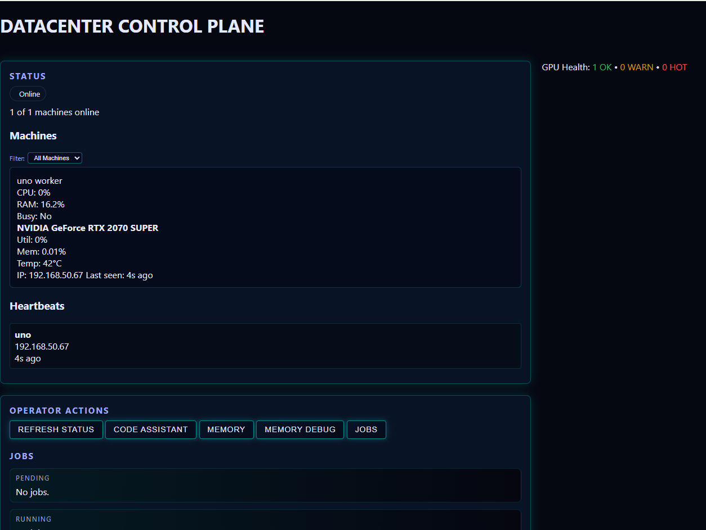
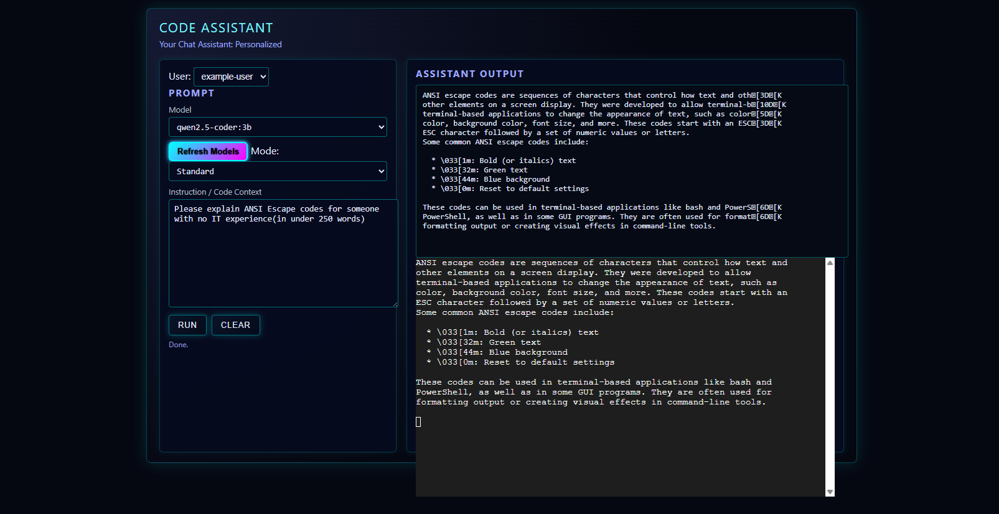
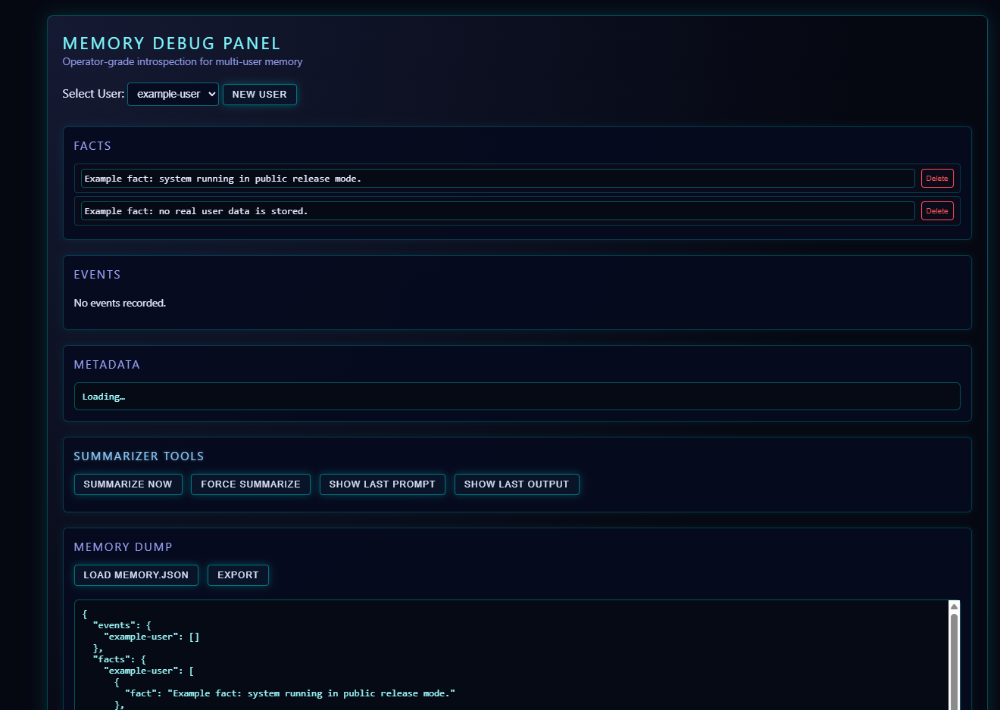

# **AI‑Memory‑Layer**  
*A practical, modular, ANSI‑intelligent memory architecture for LLM agents and AI systems.*

---

## 🌐 Overview  
Modern LLMs are powerful — but they’re **stateless**. They forget everything the moment a conversation ends.  
**AI‑Memory‑Layer** solves this by providing a structured, persistent, inspectable memory system that any AI agent can use to store, retrieve, visualize, and reason over long‑term facts.

This project introduces:

- **Structured durable memory** for agents  
- **ANSI‑intelligence** for terminal‑native visualization  
- **Cognitive path tracing** to show *why* an AI made a decision  
- **Memory-debug.html** for real‑time introspection  
- **A modular architecture** designed to plug into any LLM workflow  

The private build is currently in active development. This public repo contains the project vision, architecture, roadmap, and example scaffolding.

---

## 🧠 Why a Memory Layer  
LLMs today operate like brilliant amnesiacs. They can reason, but they cannot *remember*.  
This creates problems:

- No persistent identity  
- No long-term learning  
- No continuity across sessions  
- No way to inspect internal reasoning  
- No reproducible cognitive state  

**AI‑Memory‑Layer** provides the missing piece:  
A durable, inspectable, agent‑friendly memory substrate.

---

## 🔍 Key Concepts

### **Structured Memory Facts**  
Every memory item is stored as a typed, queryable fact.  
This enables:

- Fast retrieval  
- Categorization  
- Pruning  
- Cross-agent sharing  
- Deterministic behavior

### **ANSI‑Intelligence**  
Memory facts are color‑coded using ANSI escape sequences to provide:

- Instant visual parsing  
- Category‑based color themes  
- Cognitive path highlighting  
- Terminal‑native debugging

### **Cognitive Path Visualization**  
See exactly which memory facts influenced an agent’s output.  
This is essential for:

- Debugging  
- Safety  
- Explainability  
- Reproducibility

### **Memory-Debug Panel**  
A lightweight HTML/JS interface that shows:

- Current memory state  
- Fact categories  
- Cognitive paths  
- Agent interactions  
- Real‑time updates

---

## 🚧 Current Status  
The **private build is underway** and includes:

- Full memory engine  
- Fact categorization  
- ANSI-intelligence renderer  
- Cognitive path tracer  
- Memory-debug.html integration  
- Control-plane hooks for multi-agent systems  
- Compiler integration for agent workflows  
- and many more features to come
---
The private implementation lives in a separate branch and is not included here.

---

1) See the full project roadmap here: [ROADMAP](ROADMAP.md)
2) Learn more about how the worker agents were built: [Worker Agents](worker_agents/README.md)
3) Repo Considerations - [Secuirty](SECURITY.md)

### Acknowledgments

 This project was created by Brendan Davis.
Development was supported through iterative collaboration with Microsoft Copilot (Leah), used as an AI assistant for architectural guidance, code scaffolding, and documentation refinement. 

 License updated from GNU GPL to Apache 2.0 on July 9, 2026.
This change reflects the project's purpose as a portfolio demonstration rather than a production system. 
 
